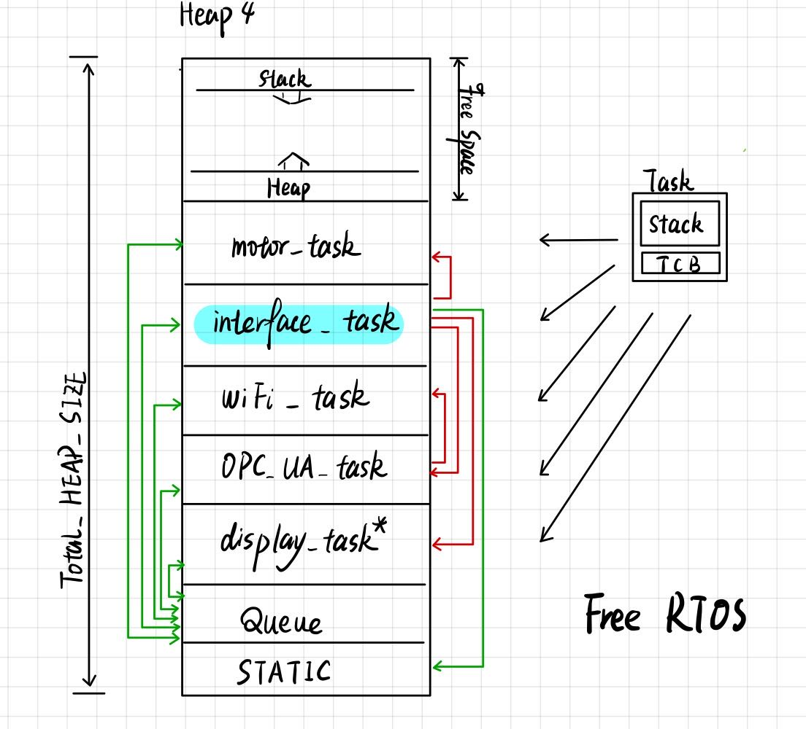
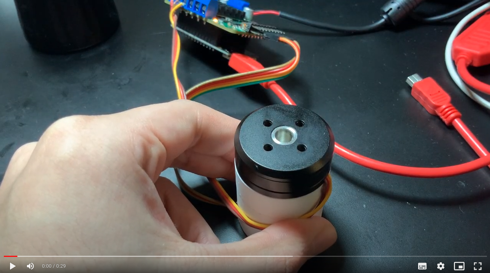

# Haptic Knob 

---

## Task structure


<center></center>

---
- motor_task: this task is used to initialise the motor and also provides some interface function to track and change the state of motor


- interface_task: main task, which provides the high level control logic of the whole project, such as change the running method (e.g. limitation, detent, etc.) and gets command from OPC UA server.

---
- WiFi_task: provides the wifi stack for OPC UA service.

- OPC_UA_task: the OPC UA bridge, establish the communication between OPC UA server and esp32 client.But now it is based on the ESP-IDF framework. A tough task is change it to Arduino framework, because SimpleFOC is based on the Arduino framework. Other problem may because of the computation and storage limitation of the ESP32, I am not sure the chip is strong enough to run the two main task as thee same time.


- display_task*: future task, this used to support the display to show some infomation.

---
## FreeRTOS Tasks

---
### 1. motor_task


```c
class MotorTask : public Task<MotorTask> {
    friend class Task<MotorTask>; // Allow base Task to invoke protected run()

    public:
        MotorTask(const uint8_t task_core);
        ~MotorTask();

    protected:
        void run();

    private:
        QueueHandle_t queue_;
        Logger* logger_;
        std::vector<QueueHandle_t> listeners_;
        char buf_[72];

        BLDCMotor motor = BLDCMotor(7, 11.2); // Motor pairs, phase resistance
        BLDCDriver3PWM driver = BLDCDriver3PWM(32, 33, 25, 22);

        // void publish(const PB_SmartKnobState& state);
        // void calibrate();
        // void checkSensorError();
        // void log(const char* msg);
};
```
---
### 1. motor_task

1. [DONE] Motor Initialisation function 
2. [DONE] transplant position control in Free RTOS
3. [DONE] Sensor(Encoder) Initialisation function
4. [DONE] the support functions for motor
5. [DONE] add Listener for Queue
6. [DONE] add logger
7. [DONE] add control interface/function to change the configuration of the BLDC motor
8. [] try to achieve the configuration with detent --> PID may have some error
9. [] Serial monitor bug
10. [] Remove calibration step

---

**Bounded 0-10 No detents**
[](https://drive.google.com/file/d/1nt68XODJvIPb3jfxIimzC8BxvcYaifqH/view?usp=share_link)

---

**Coarse values Strong detents**
[](https://drive.google.com/file/d/1mzol_WrnXnlM5CjYWrwhK6j7_i4sVrIN/view?usp=share_link)

---
**Problems:**
Vibration 

Reason:
1. PID parameters -> PID tunning 
2. magnetic sensor may not fix well, the vibration of the motor may also consequently cause the vibration of the sensor data. -> New design for the knob

---
### 2. interface_task

```c
class InterfaceTask : public Task<InterfaceTask>, public Logger {
    friend class Task<InterfaceTask>; // Allow base Task to invoke protected run()

    public:
        InterfaceTask(const uint8_t task_core, MotorTask& motor_task, DisplayTask* display_task);
        virtual ~InterfaceTask() {};

        void log(const char* msg) override;

    protected:
        void run();

    private:
        UartStream stream_;
        MotorTask& motor_task_;
        // DisplayTask* display_task_;
        char buf_[64];

        int current_config_ = 0;

        QueueHandle_t log_queue_;
        QueueHandle_t knob_state_queue_;
        SerialProtocolPlaintext plaintext_protocol_;
        SerialProtocolProtobuf proto_protocol_;

        void changeConfig(bool next);
        void updateHardware();
};
```

---
### 2. interface_task
1. [DONE] specific task configurations
2. [DONE] get state from motor 
3. [] add test module
...


---
### 3. OPC_UA_task

```c
static void opcua_task(void *arg) {

    ESP_ERROR_CHECK(esp_task_wdt_add(NULL));

    //The default 64KB of memory for sending and receicing buffer caused problems to many users. With the code below, they are reduced to ~16KB
    UA_UInt32 sendBufferSize = 16000;       //64 KB was too much for my platform
    UA_UInt32 recvBufferSize = 16000;       //64 KB was too much for my platform

    ESP_LOGI(TAG_OPC, "Initializing OPC UA. Free Heap: %d bytes", xPortGetFreeHeapSize());

    std::shared_ptr<spdlog::logger> loggerServer;
    std::shared_ptr<spdlog::logger> loggerClient;
    logger = fortiss::log::get("sensor/adc-esp32");
    logger->set_level(spdlog::level::level_enum::info);
    loggerServer = logger->clone(logger->name() + "-ua");
    loggerServer->set_level(spdlog::level::level_enum::err);
    loggerClient = logger->clone(logger->name() + "-ua-reg");
    loggerClient->set_level(spdlog::level::level_enum::err);

    ...

```

Now the problem is, the opcua task is based on the ESP-IDF framework. But simple repo using Arduino frame, I think it may be a relatively hard work to modify the opcua service to Arduino.

---
...